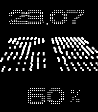

# Perspective for Pebble Time 2

A Pebble Time 2 adaptation of the original **Perspective** watchface by Jnm.



## Features

- Three-dimensional point-cloud time display
- Folded date plane above the time
- Folded battery percentage below the time
- Motion-controlled perspective with a 2× visual response
- Safe 77-degree visual tilt limit
- Shake gesture to switch between black and white themes
- Persistent theme selection
- Built exclusively for Pebble Time 2 (`emery`)

## Controls

Move or tilt the watch to change the perspective. Shake the watch to invert
the black-and-white theme.

## Build and install

```bash
pebble clean
pebble build
pebble install --phone PHONE_IP
```

## Credits

Original watchface: **Jnm**

Pebble Time 2 adaptation and additional features: **Maru**
